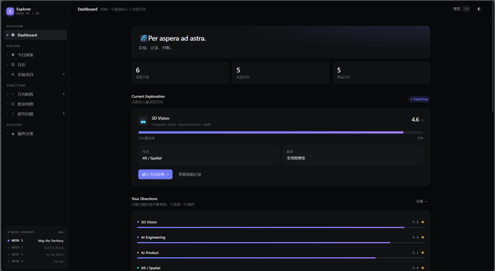
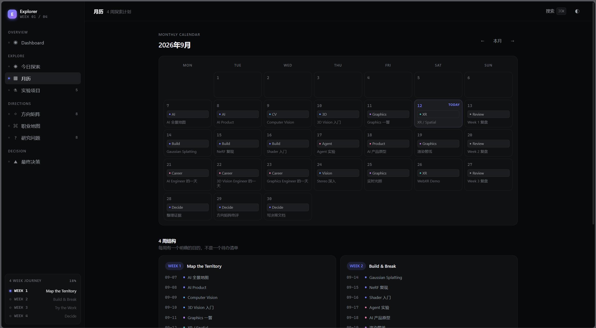
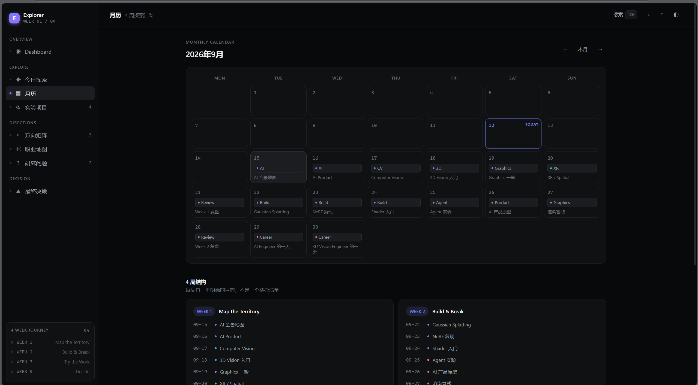
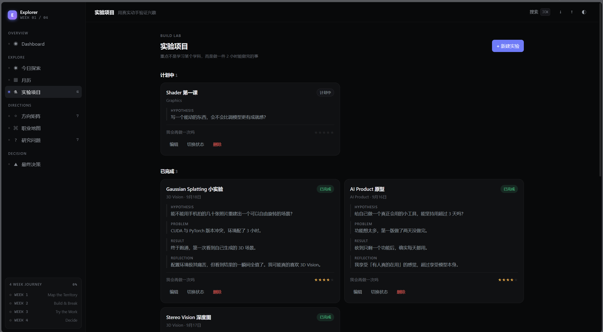

## v0.0

### 优点
1. 可交互，数据可存储

### 缺点
1. 日期从9.14开始
2. 能创建的都要能删除（项目、方向等）
3. 项目星级要可编辑，Problem、Result、Reflection在哪编辑？项目和每日任务、月任务脱钩了
4. 方向的探索记录是哪来的？（在研究问题池，需要提示）我想搞懂的问题怎么编辑？需要编辑吗？
5. 研究问题池有什么用
6. 最终决策的写下来多余

---

## v1.0

### 优点
1. 能创建的都能编辑、删除，Problem、Result、Reflection可编辑
2. 最终决策的写下来删除

